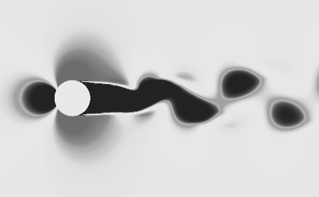

# Welcome to my Portfolio

Hi! I’m Riccardo, a Master’s student in Mechanical Engineering. This is my personal portfolio with selected academic projects in design, analysis, and engineering problem-solving. It is a continuously evolving collection of work. Feel free to explore!

## Project Showcase

* **[Vortex-Induced Vibration \\( \lvert \\) Ansys Fluent \\( \lvert \\) 2026](vortex-induced-vibrations/)** 
  *Brief description: 2D cylinder CFD analysis capturing vortex shedding and wake-structure interaction.*

* **[CFD-FEM One-Way Coupling \\( \lvert \\) Ansys Products \\( \lvert \\) 2025](cfd-fem-coupling/)** 
  *Brief description: Aircraft wing optimization through FEM and modal analysis.*

| **[Vortex-Induced Vibration \\( \lvert \\) Ansys Fluent \\( \lvert \\) 2026](vortex-induced-vibrations/)** |
| 

  

    
This project studies vortex-induced vibrations of a 2D cylinder using CFD with a SDOF structural model, capturing vortex shedding and the resulting oscillations via a transient dynamic mesh while analyzing the wake-structure interaction in time and frequency domains.

  

  

    
  
 |

<h3><a href="vortex-induced-vibrations/" style="text-decoration: none; color: inherit;">Vortex-Induced Vibration | Ansys Fluent | 2026</a></h3>

  

    
This project studies vortex-induced vibrations of a 2D cylinder using CFD with a SDOF structural model, capturing vortex shedding and the resulting oscillations via a transient dynamic mesh while analyzing the wake-structure interaction in time and frequency domains.

  

  

    
  

---

*Disclaimer: The projects, models, and simulations presented in this portfolio are intended solely for academic and illustrative purposes. The numerical data and results are not certified and should not be used for real-world industrial or commercial engineering applications.*
