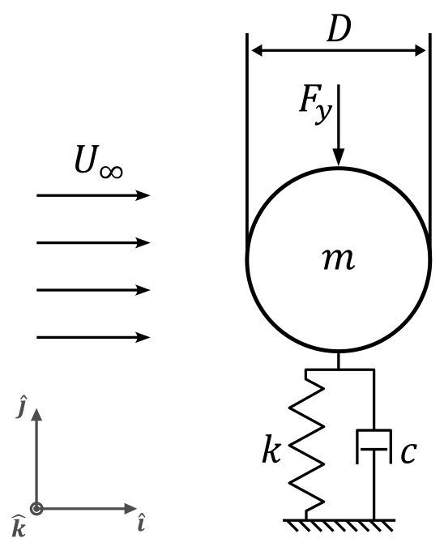
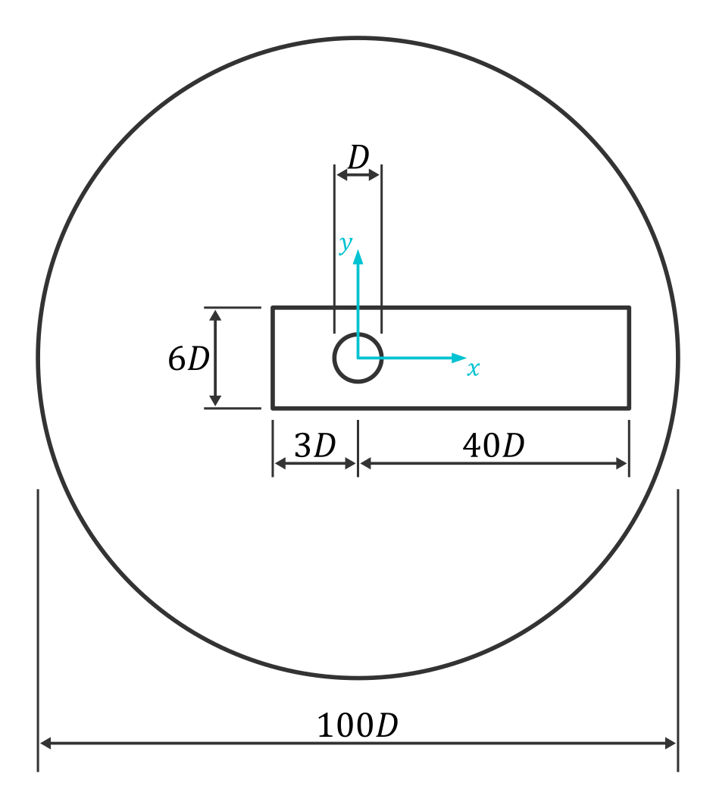
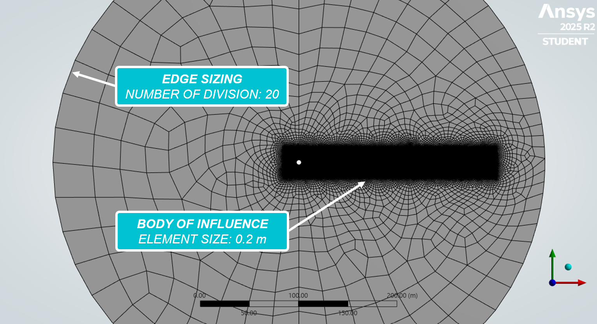
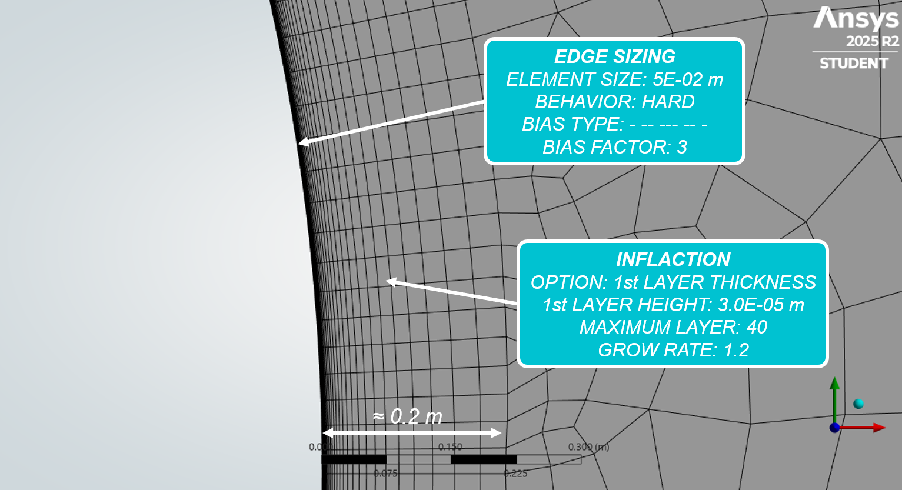
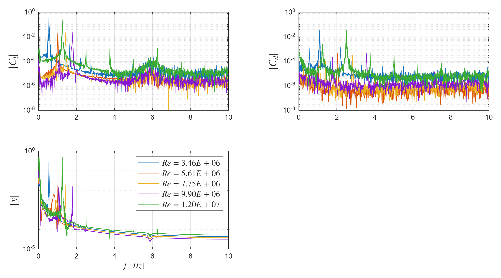

[← Back to Showcase](../index.html)

# 1. Introduction
Vortex-Induced Vibrations (VIV) are a fluid–structure interaction phenomenon that occurs when a fluid flow passes around a bluff body, such as a cylinder, generating alternating vortices in its wake (Kármán vortex street).

## 1.1 Why Does VIV Matter?
This periodic shedding of vortices produces oscillating forces perpendicular to the flow direction, which can induce vibrations in the structure. When the frequency of vortex shedding approaches the natural frequency of the structure, a resonance condition may occur, significantly amplifying the oscillation amplitude.

Understanding VIV is crucial in many engineering applications, particularly in offshore, civil and mechanical engineering. 

## 1.2 VIV for Energy Harvesting
Although often considered a source of damage, VIV can also be exploited as a renewable energy source. Flow-induced oscillations can be converted into electrical power using devices such as piezoelectric or electromagnetic systems. This approach enables the development of self-powered sensors and small-scale energy solutions.

VIV therefore represents not only a challenge, but also an opportunity in modern engineering.

# 2 Physical Model

To investigate vortex-induced vibrations (VIV), the system is modeled as a simplified fluid–structure interaction problem, where a circular cylinder is elastically mounted and free to oscillate in the transverse direction (see Figure 1).

The governing equation of motion is:

$$\ddot{y}+2\zeta\omega_n\dot{y}+\omega_n^2y=F_y/m_{eff}$$

where \( y \) is the transverse displacement, \( \omega_n \) is the natural frequency of the system, \( \zeta \) is the damping ratio, \( F_y \) is the fluid force in the transverse direction and \( m_{eff} \) is the effective mass.

***Figure 1** - Single degree of freedom model: the model intentionally neglects in-line motion to isolate cross-flow dynamics.*

# 3 Setup
## 3.1 Input Data

Different inlet velocity values are considered in order to investigate the system response over a range of flow conditions relevant to vortex-induced vibrations. The corresponding Reynolds numbers are evaluated for each case according to the standard definition:

$$Re=\frac{\rho U D}{\mu}$$

where \( \rho \) is the fluid density, \( U \) is the inlet velocity, \( D \) is cylinder diameter and \( \mu \) is the fluid viscosity.

| \( U \) [m/s] | \( Re \) |
| :--- | :--- |
| 10.1 | \( 3.46 \cdot 10^6 \) |
| 16.4 | \( 5.61 \cdot 10^6 \) |
| 22.6 | \( 7.75 \cdot 10^6 \) |
| 28.9 | \( 9.90 \cdot 10^6 \) |
| 35.2 | \( 1.20 \cdot 10^7 \) |

## 3.2 Geometry and Computational Domain

The problem is modeled as a two-dimensional flow around a circular cylinder with diameter \( D=5 \, m \).

The computational domain is designed to minimize boundary effects while keeping the computational cost reasonable. The inlet and lateral boundaries are placed sufficiently far from the cylinder to ensure that the flow development and vortex shedding are not artificially constrained by the domain size.

***Figure 2** - Geometry of the fluid domain.*

## 3.3 Mesh Strategy
A non-uniform mesh is used to resolve the boundary layer around the cylinder and the wake region where vortex shedding develops. An inflation layer is applied near the cylinder wall to properly capture near-wall gradients and the boundary layer (see Figure 3). A local refinement zone (body of influence) is introduced around the cylinder (see Figure 4) to resolve velocity gradients and flow separation while limiting numerical diffusion in the wake.

***Figure 3** - Boundary layer mesh (image used courtesy of ANSYS, Inc.).*

***Figure 4** - Wake region mesh (image used courtesy of ANSYS, Inc.).*

## 3.4 Boundary Layer Resolution
Proper resolution of the boundary layer is required to accurately capture near-wall effects, particularly for drag prediction and flow separation at high Reynolds numbers. The boundary layer thickness is estimated using the empirical relation for turbulent flow over a flat plate:

$$\delta \approx \frac{0.37x}{\sqrt{Re}}, \quad x \approx 0.5 \pi D$$

The height of the first near-wall cell is determined based on a target wall distance \( y^+ \approx 1 \):

$$y=\frac{y^+\nu}{u_\tau}$$

where the friction velocity is obtained from the skin friction coefficient:

$$C_f=\frac{0.079}{\sqrt[4]{x}}, \quad u_{\tau}=U_{\infty}\sqrt{\frac{C_f}{2}}$$

The inflation layer is then defined such that its total thickness matches the estimated boundary layer thickness \( \delta \). Assuming a geometric growth rate \( r \), the number of layers \( N \) is computed from:

$$\delta=h\sum_{i=1}^{N}r^i=h\frac{r^N-1}{r-1}$$

## 3.5 Solver Setup
The flow is modeled as incompressible, viscous air and solved using a transient approach. Simulations are performed using the SST \( k-\omega \) turbulence model. The time step is chosen based on the oscillation period:

$$\Delta t < \frac{T}{20}$$

## 3.6 Dynamic Mesh
A dynamic mesh approach is used to account for the transverse motion of the cylinder. The system is modeled as a single degree-of-freedom oscillator with:
* mass: \( m=28.5 \, kg \)
* stiffness: \( k=24.8 \, N/m \)

# 4 Results
## 4.1 Dimensionless wall distance

The time evolution of the wall unit \( y^+ \) is shown in Figure 5. The value remains nearly constant and close to 1 throughout the simulation.

***Figure 5** - Time evolution of the wall unit \( y^+ \) showing values close to 1.*

## 4.2 Frequency-domain analysis
The power spectral density (PSD) of the aerodynamic coefficients and transverse displacement is shown in Figure 6.

***Figure 6** - PSD of aerodynamic coefficients and transverse displacement.*

To quantify the response, the mean values \( \overline{X} \) and oscillation amplitudes \( |X| \) are reported in the table below.

| \( Re \) | \( \overline{C_l} \pm |C_l| \) | \( \overline{C_d} \pm |C_d| \) | \( \overline{y} \pm |y| \) |
| :--- | :--- | :--- | :--- |
| \( 3.46 \cdot 10^6 \) | \( 0.009 \pm 0.351 \) | \( 0.560 \pm 0.032 \) | \( -1.710 \, m \pm 0.290 \, m \) |
| \( 5.61 \cdot 10^6 \) | \( 0.003 \pm 0.022 \) | \( 0.373 \pm 0.000 \) | \( -1.713 \, m \pm 0.105 \, m \) |
| \( 7.75 \cdot 10^6 \) | \( 0.001 \pm 0.024 \) | \( 0.335 \pm 0.000 \) | \( -1.738 \, m \pm 0.179 \, m \) |
| \( 9.90 \cdot 10^6 \) | \( 0.003 \pm 0.025 \) | \( 0.349 \pm 0.000 \) | \( -1.472 \, m \pm 0.258 \, m \) |
| \( 1.20 \cdot 10^7 \) | \( 0.000 \pm 0.247 \) | \( 0.382 \pm 0.036 \) | \( -1.824 \, m \pm 0.524 \, m \) |

Figure 7 summarizes the variation of key quantities with Reynolds number.

***Figure 7** - Variation of the lift coefficient amplitude \( |C_l| \), mean drag coefficient \( \overline{C_d} \) and transverse displacement amplitude \( |y| \) with Reynolds number.*

# 5 Conclusion
## 5.1 Limitations of the present model
* The two
